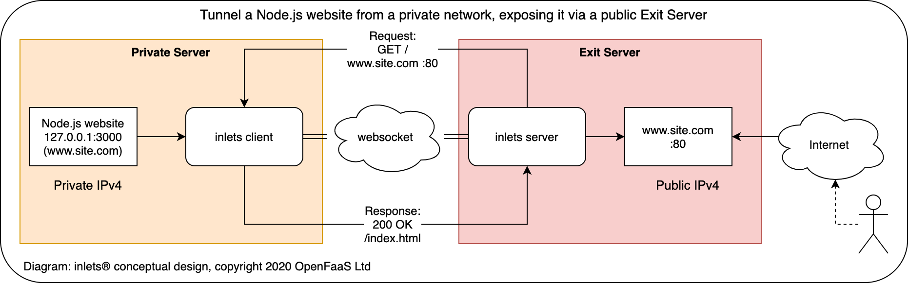

## inlets is a Cloud Native Tunnel written in Go


Expose your local endpoints to the Internet or to another network, traversing firewalls, proxies, and NAT.

This version is discontinued. But you can still use it by installing Go language and running
```
go install github.com/ashmat98/inlets@latest
```

[Quick Start](./docs/quickstart.md) <br/>
[Advanced](./docs/advanced.md) <br/>
[Community](./docs/community.md)


## Intro

inlets combines a reverse proxy and websocket tunnels to expose your internal and development endpoints to the public Internet via an exit-server. An exit-server may be a 5-10 USD VPS or any other computer with an IPv4 IP address. You can also tunnel services without exposing them on the Internet, making inlets a suitable replacement for a VPN.

Why do we need this project? Similar tools such as [ngrok](https://ngrok.com/) or [Argo Tunnel](https://developers.cloudflare.com/argo-tunnel/) from [Cloudflare](https://www.cloudflare.com/) are closed-source, have limits built-in, can work out expensive, and have limited support for arm/arm64. Ngrok is also often banned by corporate firewall policies meaning it can be unusable. Other open-source tunnel tools are designed to only set up a single static tunnel.

With inlets you can set up your own self-hosted tunnel, copy over the static binary and start tunnelling traffic without any arbitrary limits or restrictions. When combined with TLS, inlets can be used with most corporate HTTP proxies.



*Conceptual diagram for inlets*

## Do you use inlets? Sponsor the author

Alex is the primary author and maintainer of inlets, if you use the project, become a sponsor of the project on GitHub.


### SWAG and merchandise

Head over to the new [SWAG store](https://store.openfaas.com/) to get your very own branded inlets hoodie, t-shirt and mug.

<a href="https://store.openfaas.com/">

</a>

> Support the project by purchasing inlets SWAG or [sponsoring on GitHub](https://github.com/sponsors/inlets)

## About inlets

inlets uses a websocket to create to create a tunnel between a client and a server. The server is typically a machine with a public IP address, and the client is on a private network with no public address.

inlets is considered production-ready, but you should do some testing before you depend on it, or use [inlets PRO](https://inlets.dev/) which is commercially supported.

### Private or public tunnels?

* A public tunnel is where you expose the private service to users via the server's public IP
* A private tunnel is where you start a tunnel to a server and only expose it on the server's LAN address

### Features

* Tunnel HTTP or websockets
* Client announces the tunnelled services to the server
* Expose multiple sites on same port through the use of DNS entries and a `Host` header
* Upgrade to link encryption using TLS for websockets (`wss://`) with an external add-on, or [inlets PRO](https://inlets.dev)
* Shared authentication token for the client and server
* Automatic reconnects for when the connection drops
